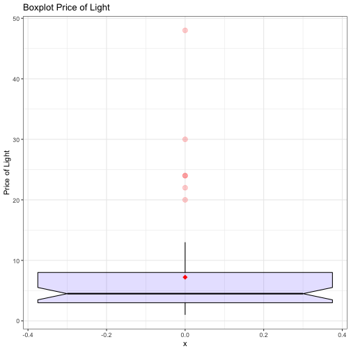

DATA TIDYING PRESENTATION
========================================================
author:  Amalia Jiménez Toledano
transition: concave
css: custom.css


READ THE DATA AND SUMMARY
========================================================
type: prompt


**The variables of the data are the following:**

- **ID**: 	Case ID
- **Amount**: Net dollar amount spent by customers in their latest purchase from this retailer
- **Recency**:	Number of months since the last purchase
- **Freq12**:	Number of purchases in the last 12 months
- **Dollar12**:	Dollar amount of purchases in the last 12 months
- **Freq24**:	Number of purchases in the last 24 month
- **Dollar24**:	Dollar amount of purchases in the last 24 months
- **Card**:	1 for customers who have a private-label credit card with the retailer, 0 if not


AIMS OF THE WORK
========================================================
type: prompt

- Boxplot about some variables: [Go to slide 1](#/boxplot)


DATABASE CONSIDERATIONS
========================================================
type: prompt
id: summary


```r
str(Clothing)
```

```
'data.frame':	60 obs. of  8 variables:
 $ ID      : int  1 2 3 4 5 6 7 8 9 10 ...
 $ Amount  : int  0 0 0 30 33 35 35 39 40 45 ...
 $ Recency : int  22 30 24 6 12 48 5 2 24 3 ...
 $ Freq12  : int  0 0 0 3 1 0 5 5 0 6 ...
 $ Dollar12: int  0 0 0 140 50 0 450 245 0 403 ...
 $ Freq24  : int  3 0 1 4 1 0 6 12 1 8 ...
 $ Dollar24: int  400 0 250 225 50 0 415 661 225 1138 ...
 $ Card    : int  0 0 0 0 0 0 0 1 0 0 ...
```


```r
Clothing$Car <- as.factor(Clothing$Car)
```


Box Plot 
=======================================================
type: prompt
id: boxplot



hhhhhhh hhhhhhhhhhhhh

Tabla
========================================================
id: tables
type: prompt


```r
out <- lm(Amount ~ Freq24+Dollar24,data=Clothing)
library(knitr)
kable(summary(out)$coef, digits=2)
```


|            |  Estimate| Std. Error| t value| Pr(>&#124;t&#124;)|
|:-----------|---------:|----------:|-------:|------------------:|
|(Intercept) | -22549.67|   17243.14|   -1.31|                0.2|
|Freq24      | -14210.51|    3025.79|   -4.70|                0.0|
|Dollar24    |    193.04|       8.55|   22.57|                0.0|


this is the equation $$y_i=\beta_1*x_1+beta_2*x_2 $$


Slide 2
====================================
[Go to slide 1](#/slide1)
