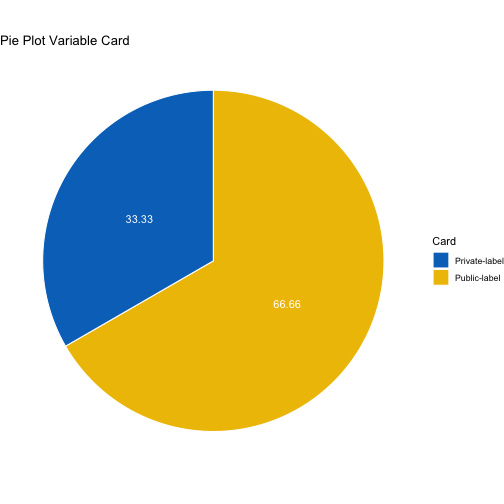

DATA TIDYING PRESENTATION
========================================================
author:  Amalia Jiménez Toledano
transition: concave
css: custom.css
autosize: true
width: 1500
height: 900


READ THE DATA AND SUMMARY
========================================================
type: prompt


**The variables of the data are the following:**

- **ID**: 	Case ID
- **Amount**: Net dollar amount spent by customers in their latest purchase from this retailer
- **Recency**:	Number of months since the last purchase
- **Freq12**:	Number of purchases in the last 12 months
- **Dollar12**:	Dollar amount of purchases in the last 12 months
- **Freq24**:	Number of purchases in the last 24 month
- **Dollar24**:	Dollar amount of purchases in the last 24 months
- **Card**:	1 for customers who have a private-label credit card with the retailer, 0 if not


AIMS OF THE WORK
========================================================
type: prompt

The following are some of the results obtained on the previously mentioned database:

- Summary table about variables: [Sumamary Click](#/boxplot)
- Box-plot about some variables: [Box-plot Click](#/summary)
- Regression model: [Regression Click](#/regression)
- Results about Card variable: [Card Variable Click](#/summary)


DATABASE CONSIDERATIONS
========================================================
type: prompt
id: summary


```r
summary(Clothing)
```

```
       ID            Amount           Recency           Freq12      
 Min.   : 1.00   Min.   :      0   Min.   : 1.000   Min.   : 0.000  
 1st Qu.:15.75   1st Qu.:     50   1st Qu.: 3.000   1st Qu.: 1.000  
 Median :30.50   Median :     70   Median : 4.500   Median : 3.000  
 Mean   :30.50   Mean   :  25201   Mean   : 7.217   Mean   : 2.883  
 3rd Qu.:45.25   3rd Qu.:    100   3rd Qu.: 8.000   3rd Qu.: 4.000  
 Max.   :60.00   Max.   :1506000   Max.   :48.000   Max.   :10.000  
    Dollar12          Freq24          Dollar24           Card       
 Min.   :   0.0   Min.   : 0.000   Min.   :   0.0   Min.   :0.0000  
 1st Qu.: 107.5   1st Qu.: 4.000   1st Qu.: 260.2   1st Qu.:0.0000  
 Median : 223.5   Median : 6.000   Median : 461.5   Median :0.0000  
 Mean   : 372.0   Mean   : 5.617   Mean   : 660.8   Mean   :0.3333  
 3rd Qu.: 406.5   3rd Qu.: 7.250   3rd Qu.: 718.5   3rd Qu.:1.0000  
 Max.   :5000.0   Max.   :13.000   Max.   :8000.0   Max.   :1.0000  
```

Since the variable "Card" is categorical, the transformation is performed:


```r
Clothing$Car <- as.factor(Clothing$Car)
```


Box Plot 
=======================================================
type: prompt
id: boxplot


REGRESSION
========================================================
id: regression
type: prompt


```r
out <- lm(Amount ~ Freq24+Dollar24,data=Clothing)
library(knitr)
kable(summary(out)$coef, digits=2)
```


|            |  Estimate| Std. Error| t value| Pr(>&#124;t&#124;)|
|:-----------|---------:|----------:|-------:|------------------:|
|(Intercept) | -22549.67|   17243.14|   -1.31|                0.2|
|Freq24      | -14210.51|    3025.79|   -4.70|                0.0|
|Dollar24    |    193.04|       8.55|   22.57|                0.0|


this is the equation $$y_i=\beta_1*x_1+beta_2*x_2 $$


CATEGORICAL VARIABLE
========================================================
id: regression
type: prompt





